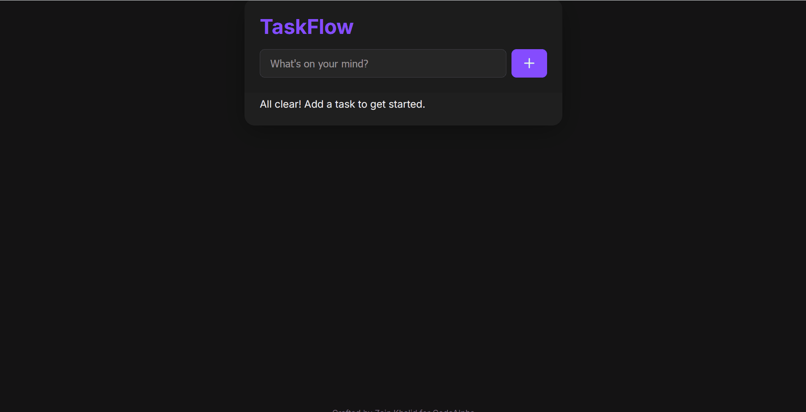

# TaskFlow - A Minimalist To-Do App

A minimalist to-do list web app designed for clarity and efficiency. This project features full CRUD functionality and persists data in the browser's local storage. Built as a core task for the CodeAlpha web development internship.

### ✨ [Live Demo](https://zainnextdev.github.io/CodeAlpha_ToDoList/)

---



---

## 🚀 Key Features

*   **Full CRUD Functionality:** Users can seamlessly **C**reate, **R**ead, **U**pdate (mark as complete), and **D**elete tasks.
*   **Persistent Storage:** Tasks are saved to the browser's `localStorage`, so your to-do list is preserved even after closing the tab or browser.
*   **Modern & Clean UI:** A distraction-free interface with smooth animations for adding and removing tasks, enhancing the user experience.
*   **State-Driven UI:** The application logic is architected to render the UI based on a state array, a core concept in modern frameworks like React.
*   **Efficient Event Handling:** Uses event delegation for optimal performance, regardless of the number of tasks.

## 🛠️ Tech Stack

*   **HTML5:** For the semantic structure of the to-do list.
*   **CSS3:** For styling the application, including a dark theme and subtle transition effects for a satisfying user interaction.
*   **JavaScript (ES6+):** For handling the application's state, CRUD operations, DOM manipulation, and interaction with `localStorage`.

## 📂 Project Structure

```
CodeAlpha_ToDoList/
├── index.html
├── style.css
└── script.js
```

## 📜 About This Project

The TaskFlow app demonstrates proficiency in handling dynamic data and state management with vanilla JavaScript. The implementation of local storage and a state-driven rendering approach showcases an understanding of concepts that are foundational to building more complex, data-driven applications.
